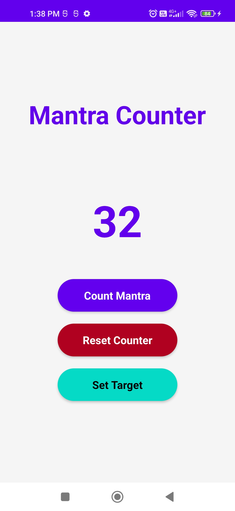

# Mantra Counter 🧘

A beautiful and intuitive mobile app for counting mantras, prayers, or affirmations with target tracking and vibration notifications.



## Features ✨

- ➕ Simple one-tap counting
- 🎯 Set customizable targets (e.g., 108 repetitions)
- 🔔 Vibration notification when target is reached
- 🔄 Reset counter with one click
- 💾 Automatic saving of counts between sessions
- 🌙 Clean, meditation-friendly interface

## Installation ⚙️

### Prerequisites
- Node.js (v16 or newer)
- npm or yarn
- React Native CLI
- Android Studio/Xcode (for emulator)

### Steps
1. Clone the repository:
   ```bash
   git clone https://github.com/samipevekar/Mantra-Counter-assignment-.git
   cd mantra-counter
    ```
2. Install dependencies
    ```bash
    npm install
    ```

3. Run project
    ###### for Android
    ```bash
    npm run android
    ```
    ###### for Ios
    ```bash
    npm run ios
    ```

## Demo 

- ▶️ **Video Demo:** [Watch on Google Drive](https://drive.google.com/file/d/1Htb3JtZcHMXTOIt7oSXgeAXw71w6RHMs/view?usp=drive_link)

- 📱 **Download App (APK):** [Get APK from Google Drive](https://drive.google.com/file/d/1643Rfww17BlBHfOVxg81ToVXBkT8BWoF/view?usp=drive_link)
